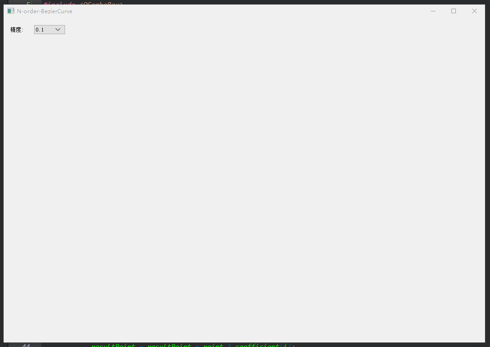
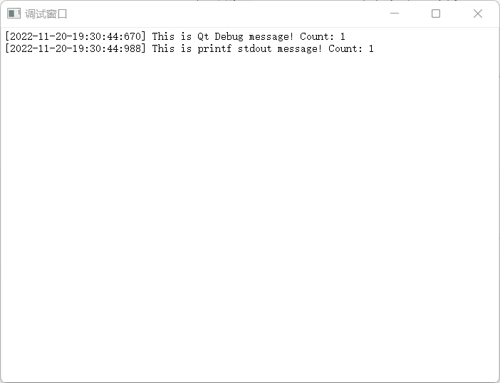
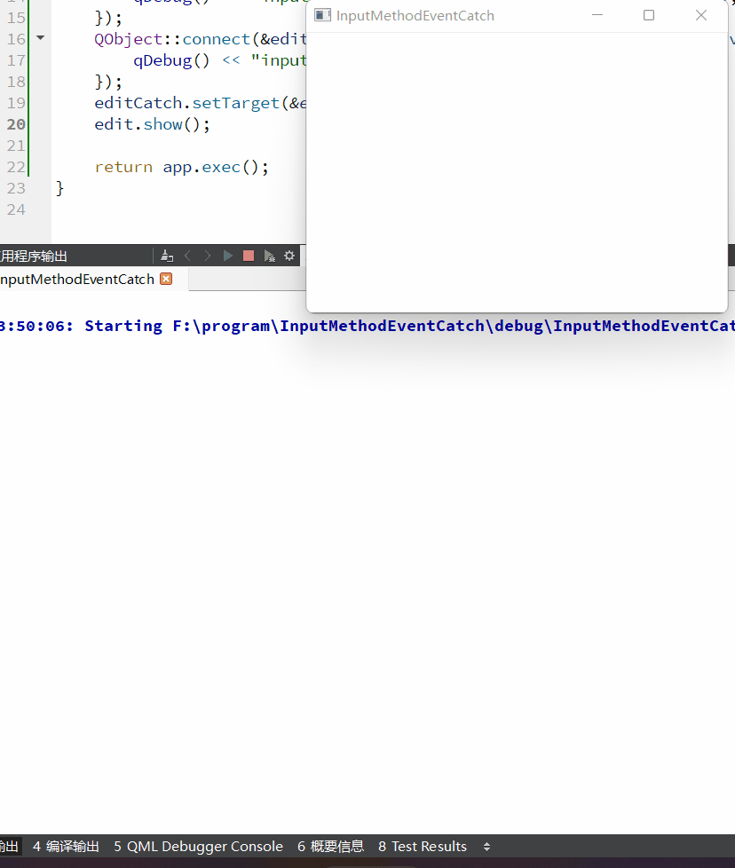
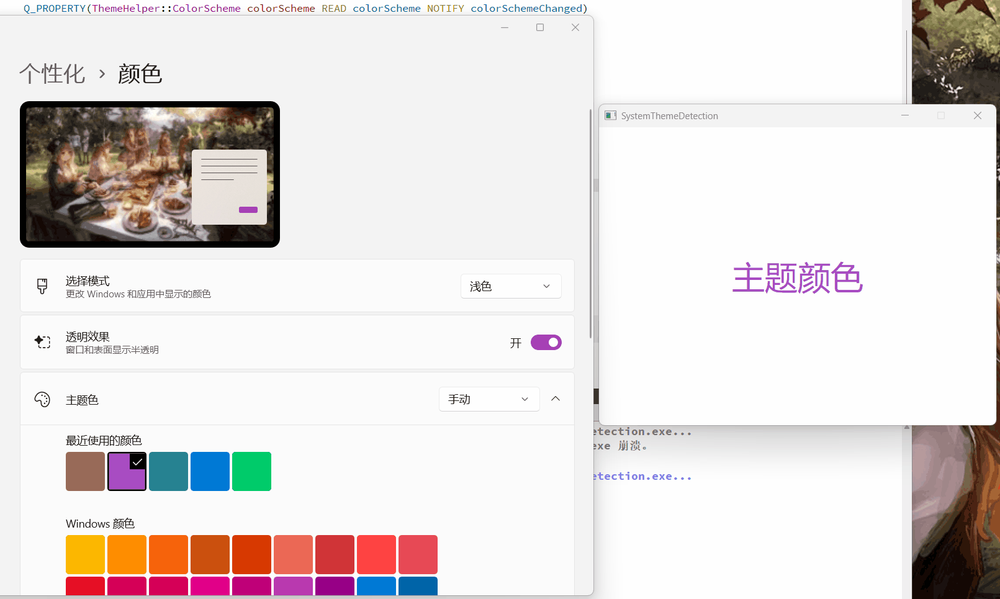

## 示例预览

 - N-order-BezierCurve Qt 中实现任意N阶贝塞尔曲线绘制 & 动态调节

.

 - CaptureStdPrint Qt 中捕获三方库&自身标准打印方法

 - InputMethodEventCatch Qt / Qml 中捕获(中文)输入法事件(按下 & 提交)

 - SystemThemeDetection (Qt5 / Qt6) 系统主题检测(Dark / Light) & 主题变化通知

